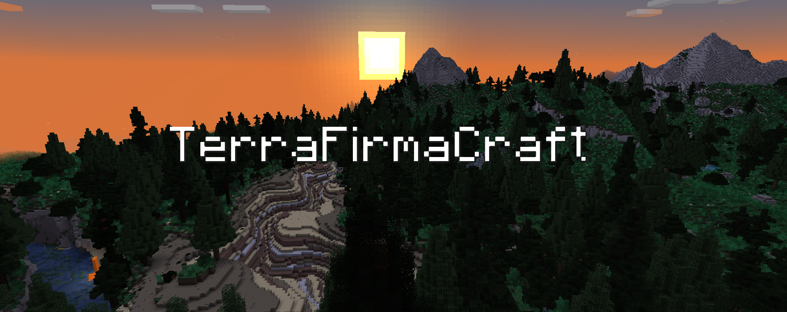

*Survival Mode As It Should've Been*

### About

TerraFirmaCraft (TFC) is a total conversion mod that overhauls and reinvents survival mode. The goal of the mod is to create a believable, challenging survival experience, in a brand new immersive setting. It completely overhauls Minecraft world generation - from adding plate tectonics, to flowing rivers, to mountain ranges, to varied and diverse forests, flora, and fauna. Below is a list of some of the features of this mod:

- The underground has been completely reimagined, with layers of different types of rock, and massive sparse ore deposits of several different types.
- A fully fledged technology tree, from pottery and pit kilns, to charcoal production, producing iron with a bloomery, steel making and more.
- Seasons, weather, and a realistic climate and calendar model cause the player to need to stockpile food for winter to survive.
- The world is alive, with many different plants, wild crops, wild fruits, animals - both passive and predators - to find
- The player must manage their food's expiration, nutrition, and thirst using our detailed food and cooking mechanics.

In order to understand all of these new features, TerraFirmaCraft comes with a detailed in-game Field Guide, which is available from the moment you spawn in, and will guide you through the art of surviving in this brand-new world.

### Links

- [Download on CurseForge](https://www.curseforge.com/minecraft/mc-mods/terrafirmacraft)
- [Discuss on Discord](https://discord.gg/PRuAKvY)
- [Read the Field Guide (Players)](https://terrafirmacraft.github.io/Field-Guide/en_us/)
- [Read the API Documentation (Pack Makers / Addons)](https://terrafirmacraft.github.io/Documentation/)

### Contributing

 - Firstly, join our [Discord](https://invite.gg/terrafirmacraft), as it's where all discussion surrounding development, tasks, and decisions happens.
 - As per the Github terms of service, you grant us the right to use your contribution under the same license as this project.
 - In addition, we request that you give us the right to change the license in the future.
 - Import & use the project's Code Style. (Recommend using Intellij as that's what our code style xml is based on)
- Before creating a Pull Request, run `gradlew updateLicenses`. This will apply the correct license header to all project files.
- We use python for data and asset generation, among other things. In order to run the generation scripts (all found in `/resources`), you will need to install the python modules `mcresources`, `pillow`, `nbtlib`, and `Levenshtein` (see `resources/requirements.txt`).

### Legal

Licensed under the [EUPL, Version 1.2](LICENSE.txt) unless otherwise noted.

- `FastNoiseLite.java` is licensed under the [MIT License](https://github.com/Auburn/FastNoiseLite/blob/72d212e005e62c886c06f55f740571116f361571/LICENSE) and is modified from [FastNoiseLite](https://github.com/Auburn/FastNoiseLite)
- `resources/bsc5p_radec_min.json` is a catalog and is used under the [CC-BY 4.0](https://creativecommons.org/licenses/by/4.0/deed.en) unmodified from [BSC5P-JSON-XYZ](https://github.com/frostoven/BSC5P-JSON-XYZ)
- Sounds are used under [CC0](https://creativecommons.org/publicdomain/zero/1.0/) unless otherwise noted.
- `rock_slide_long_3` is licensed under [CC-BY-4.0](https://creativecommons.org/licenses/by/4.0/), and has been modified from the [original work](https://freesound.org/people/Benboncan/sounds/60085/).

### Acknowledgments

Based on original work by Robert "Bioxx" Anthony, Amanda "Kittychanley" Halek and others.

Music by Mike "Menoch" Pelaez

Parts of this project are edited source code from the original TerraFirmaCraft for 1.7.10 mod. They are used under a different license with permission from the original author (Bioxx).
